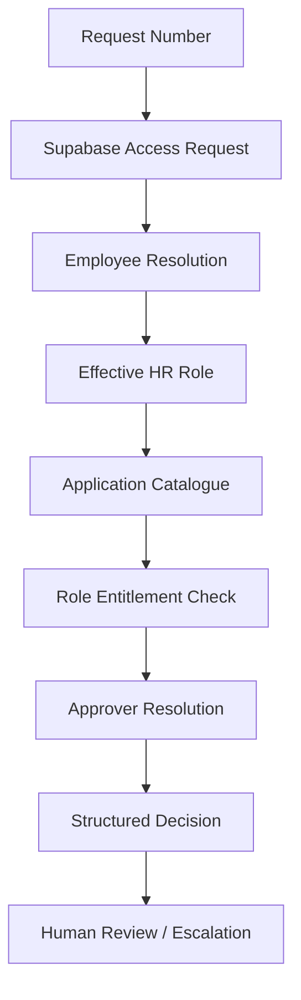

# AutoPilot C2 — Role-Based Access & Asset Governance

> **AutoPilot Ahmedabad Hackathon | Domain C2 | Team Error**  
> Building an AI Employee that evaluates access requests against HR role history and entitlement policies using Supervity and Supabase.

## 🌙 Development Progress — October 10, 2026

**Work session:** 12:00 AM – 1:30 AM IST  
**Duration:** 1 hour 30 minutes  
**Status:** Initial end-to-end policy evaluation executed successfully for the sample request.

Tonight's focus was connecting the database to the automation workflow, implementing the core decision pipeline, and validating the role-based access scenario.

## 🎯 Project Objective

Build an AI-powered workflow that processes access and asset requests by:

- Retrieving requests from Supabase.
- Resolving an employee's effective HR role on the request date.
- Detecting outdated IAM role information.
- Mapping requested applications to standardized entitlement codes.
- Validating requests against a role-entitlement matrix.
- Identifying the appropriate application owner for exceptions.
- Producing structured recommendations with clear reasoning.
- Supporting human approval and auditable outcomes.

The primary governance rule is simple: **a successful entitlement lookup does not automatically authorize an access grant.**

## ⏱️ Work Log — Time-Sliced Progress

| Time (IST) | Work completed |
|---|---|
| 12:00–12:15 AM | Prepared the C2 implementation approach and identified the core Supabase data sources required for request evaluation. |
| 12:15–12:30 AM | Verified the access-request record `RITM0041628` and inspected the HR role-change record `HRC-26-1112`. |
| 12:30–12:45 AM | Confirmed the effective role transition from `DESIGN_ENGINEER` to `QA_QC_ENGINEER`, effective September 29, 2026. |
| 12:45–1:00 AM | Verified entitlement and application-catalogue lookups for AutoCAD Full, entitlement `ACAD_FULL`. |
| 1:00–1:15 AM | Executed the Supervity workflow through employee resolution, entitlement evaluation, and application-owner routing. |
| 1:15–1:30 AM | Reviewed the execution output, validated the IAM mismatch and missing entitlement, and identified the next workflow improvements. |

*Note: These are approximate work-log slices for the stated 90-minute session, not individually timestamped Git commits.*

## 🏗️ Architecture

### Technology Stack

- **Supervity Auto Business** — workflow automation and Operators
- **Supabase PostgreSQL** — request, employee, HR history, entitlement, and application-catalogue data
- **Supabase REST API** — database retrieval over HTTP
- **JSON** — structured decision output
- **Outlook integration** — intended notification and approval communication path, subject to implementation and testing

## 🗄️ Core Database Tables

| Table | Purpose |
|---|---|
| `access_request` | Original request, beneficiary, requested item, justification, and state |
| `person` | Employee identity, current IAM role, manager, and employment details |
| `hr_role_change` | Effective-dated HR role transitions |
| `role_entitlement` | Role-to-entitlement permissions, access levels, and approval requirements |
| `application_catalogue` | Entitlement mapping, licence metadata, and application owners |

## 🧪 Evidence From the First End-to-End Execution

### Test request: `RITM0041628`

| Attribute | Verified result |
|---|---|
| Employee | Hardik Raval |
| Employee ID | `E37175` |
| Requested item | AutoCAD (full) |
| Request date | October 1, 2026 |
| HR change | `HRC-26-1112` |
| Effective HR role | `QA_QC_ENGINEER` |
| IAM directory role | `DESIGN_ENGINEER` |
| Entitlement code | `ACAD_FULL` |
| Role-entitlement match | No match |
| Application owner | Rutvik Joshi (`E52098`) |
| Workflow recommendation | `HOLD_FOR_REVIEW` |
| Workflow state | `PENDING_REVIEW` |

### What the test demonstrated

1. The Supabase HTTP integration successfully retrieved the request.
2. The workflow reconstructed the effective HR role using the role-change effective date.
3. The workflow detected that the IAM directory role was outdated.
4. The application catalogue resolved AutoCAD Full to `ACAD_FULL`.
5. The entitlement check found no matching permission for `QA_QC_ENGINEER`.
6. The approver-routing step identified Rutvik Joshi as the application owner.
7. The final step generated a structured JSON decision with a manual-review recommendation.

**Result:** The core data-retrieval and policy-evaluation pipeline executed successfully for the sample request.

## 📌 Current Status

### Completed

- [x] Supabase database populated and accessible.
- [x] HTTP GET integration tested successfully.
- [x] Access request retrieval implemented and executed.
- [x] Effective HR role resolution implemented and executed.
- [x] IAM mismatch detection executed.
- [x] Application and entitlement mapping executed.
- [x] Role-entitlement evaluation executed.
- [x] Application-owner routing executed.
- [x] Structured decision output generated.

### Remaining Work

- [ ] Refine the final recommendation to distinguish `ESCALATE_OUT_OF_ROLE` from generic `HOLD_FOR_REVIEW`.
- [ ] Implement and verify actual application-owner notifications.
- [ ] Implement secure human approval/decline response handling.
- [ ] Add verified decision recording or audit write-back.
- [ ] Validate temporary-access expiry rules.
- [ ] Test additional requests, including in-role requests and missing-data scenarios.
- [ ] Verify retry handling and duplicate-notification prevention.
- [ ] Prepare a five-minute hackathon demonstration.

The notification, approval-response, and audit-writeback steps are not yet confirmed as working.

## 🚀 Next Development Session — October 10

The next session will focus on turning the evaluated recommendation into a complete decision workflow.

1. Refine the out-of-role decision branch.
2. Connect the escalation action to the configured communication channel.
3. Add verified human decision handling.
4. Record decisions safely without claiming an access grant prematurely.
5. Test multiple requests, including a fresh request not used during development.
6. Capture evidence and update this README with actual results.

### Target outcome

A repeatable request-to-decision automation that evaluates new requests, explains its decisions, routes exceptions correctly, and preserves human control over access grants.

---

## 👥 Team

**Team Name:** Error  
**Hackathon:** AutoPilot Ahmedabad  
**Domain:** C2 — Role-Based Access and Asset Requests

Built incrementally with an emphasis on automation, effective-dated identity data, access governance, and human-in-the-loop decision-making.

#AutoPilotAhmedabad #Supervity #Supabase #Automation #AccessGovernance #AI #Hackathon #BuildInPublic
